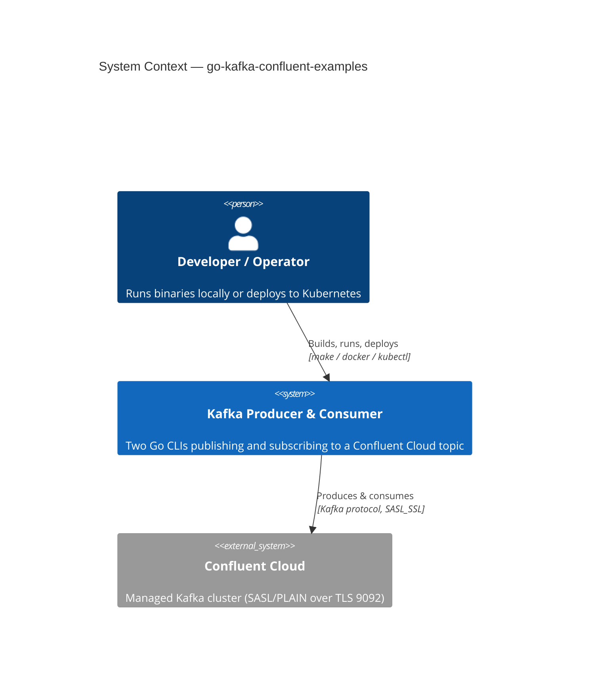
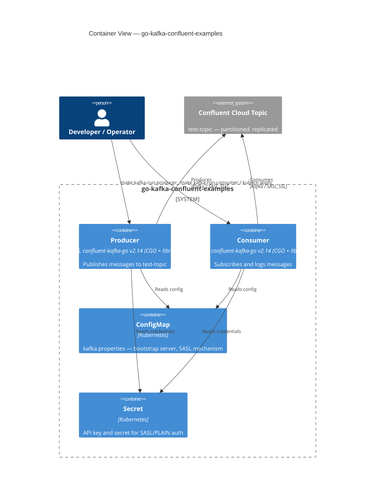
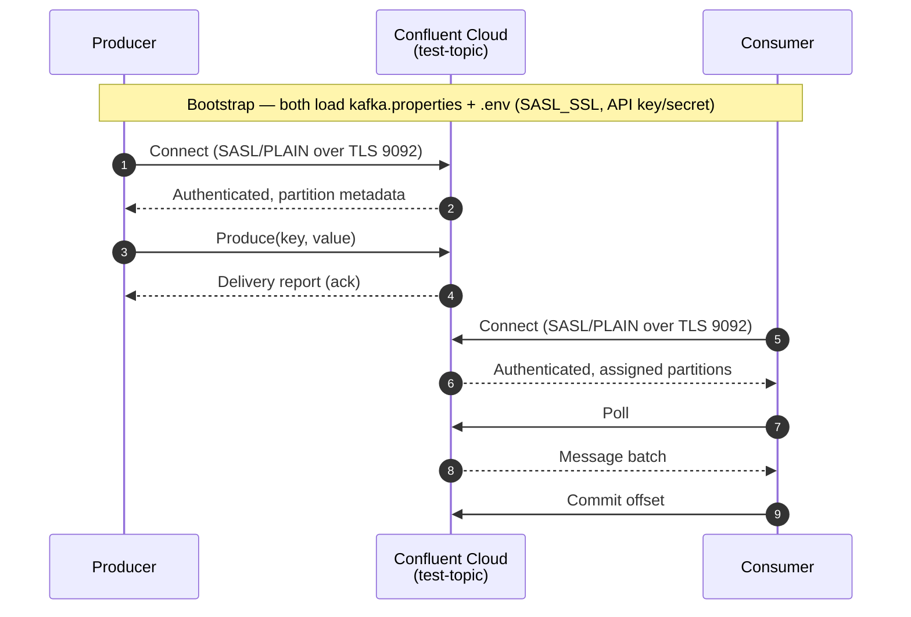

[](https://github.com/AndriyKalashnykov/go-kafka-confluent-examples/actions/workflows/ci.yml)
[](https://hits.sh/github.com/AndriyKalashnykov/go-kafka-confluent-examples/)
[](https://opensource.org/licenses/MIT)
[](https://app.renovatebot.com/dashboard#github/AndriyKalashnykov/go-kafka-confluent-examples)

# Go producer & consumer examples for Confluent Kafka Cloud

Reference implementation of a [Confluent Cloud](https://confluent.cloud/) Kafka producer and consumer in Go using the [confluent-kafka-go](https://github.com/confluentinc/confluent-kafka-go/) client. Demonstrates CGO-linked `librdkafka` builds, Kubernetes `ConfigMap`/`Secret` credential injection, Docker Compose local runtime, and GoReleaser cross-compilation for Linux + macOS.



## Tech Stack

| Component | Technology |
|-----------|------------|
| Language | Go 1.26.2 |
| Kafka client | [confluent-kafka-go](https://github.com/confluentinc/confluent-kafka-go) v2.14.0 |
| Native library | `librdkafka` (CGO-linked) |
| Build | Make, GoReleaser (cross-compilation) |
| Container | Docker, Docker Compose |
| Orchestration | Kubernetes (`k8s/` manifests) |
| CI/CD | GitHub Actions |
| Static analysis | golangci-lint, gosec, govulncheck, gitleaks, actionlint, shellcheck, hadolint, trivy |
| Version manager | [mise](https://mise.jdx.dev) (`.mise.toml`, `.nvmrc`) |
| Dependency management | Renovate (automerge enabled) |

## Quick Start

```bash
make deps                  # install mise-managed Go + tooling
make build                 # build producer and consumer binaries
make test                  # run tests
make kafka-run-producer    # run producer
make kafka-run-consumer    # run consumer
```

## Prerequisites

| Tool | Version | Purpose | Auto-installed by |
|------|---------|---------|-------------------|
| [GNU Make](https://www.gnu.org/software/make/) | 3.81+ | Build orchestration | — |
| [mise](https://mise.jdx.dev) | latest | Go + Node version management | `make deps` |
| [Go](https://go.dev/dl/) | 1.26.2 (from `go.mod`) | Language runtime and compiler | `make deps` (via mise + `.mise.toml`) |
| `librdkafka` + C toolchain | latest | Required by `confluent-kafka-go` (CGO) | System package (Alpine: `librdkafka-dev musl-dev gcc g++`) |
| [Docker](https://www.docker.com/) | latest | Container builds and Compose | — |
| [kubectl](https://kubernetes.io/docs/tasks/tools/) | latest | Kubernetes deployment, required for `make e2e` | — |
| [KinD](https://kind.sigs.k8s.io/) | 0.26.0+ | Ephemeral Kubernetes cluster for `make e2e` | — |
| [Confluent CLI](https://docs.confluent.io/confluent-cli/current/install.html) | latest | Confluent Cloud cluster/topic setup | — |
| [golangci-lint](https://golangci-lint.run/) | 2.11.4 | Go lint | `make deps` |
| [hadolint](https://github.com/hadolint/hadolint) | 2.14.0 | Dockerfile lint | `make deps-hadolint` |
| [act](https://github.com/nektos/act) | 0.2.87 | Run CI workflows locally | `make deps-act` |
| [Git](https://git-scm.com/) | latest | Version control | — |

Install all required dependencies:

```bash
make deps
```

## Architecture

### Container View



- **Producer** / **Consumer** — statically-linked Go binaries; both depend on `librdkafka` via CGO (see [`Dockerfile.consumer`](Dockerfile.consumer) for the Alpine build chain)
- **ConfigMap** holds non-secret Kafka client settings (`bootstrap.servers`, `security.protocol`, `sasl.mechanism`); **Secret** holds the API key/secret pair — both are mounted into the consumer pod by `k8s/deployment.yaml`
- **Confluent Cloud Topic** is external; authentication is SASL/PLAIN over TLS

### Produce → Consume Flow



Source diagrams live inline in this README; lint via `make mermaid-lint` (pinned [`minlag/mermaid-cli`](https://github.com/mermaid-js/mermaid-cli) Docker image).

## Usage

### Configure Confluent Kafka Go Client

Prerequisites: Confluent Cloud account with Environment and Cluster.

- Export Confluent Environment ID as `CONFLUENT_ENV`:
  ```bash
  xdg-open https://confluent.cloud/environments
  export CONFLUENT_ENV=
  ```
- Export Confluent cluster ID as `CONFLUENT_CLUSTER`:
  ```bash
  xdg-open "https://confluent.cloud/environments/$CONFLUENT_ENV/clusters"
  export CONFLUENT_CLUSTER=
  ```
- Select Environment and Cluster:
  ```bash
  confluent environment use "$CONFLUENT_ENV"
  confluent kafka cluster use "$CONFLUENT_CLUSTER"
  confluent login --save
  ```
- Create a new API key and secret pair:
  ```bash
  confluent api-key create --resource "$CONFLUENT_CLUSTER"
  ```
- Export previously created KEY and SECRET:
  ```bash
  export CONFLUENT_API_KEY=
  export CONFLUENT_API_SECRET=
  confluent api-key use "$CONFLUENT_API_KEY" --resource "$CONFLUENT_CLUSTER"
  ```
- Export Confluent Kafka Cluster Bootstrap Server (Cluster settings → Endpoints → Bootstrap server) and render config templates:
  ```bash
  xdg-open "https://confluent.cloud/environments/$CONFLUENT_ENV/clusters/$CONFLUENT_CLUSTER/settings/kafka"
  export CONFLUENT_BOOTSTRAP_SERVER=
  sed -e "s%BTSTRP%$CONFLUENT_BOOTSTRAP_SERVER%g" ./tmpl/kafka.properties.tmpl > ./kafka.properties
  sed -e "s%BTSTRP%$CONFLUENT_BOOTSTRAP_SERVER%g" \
      -e "s%APIKEY%$CONFLUENT_API_KEY%g" \
      -e "s%APISECRET%$CONFLUENT_API_SECRET%g" ./tmpl/.env.tmpl > ./.env
  ```
- Create the Confluent Kafka topic:
  ```bash
  confluent kafka topic create test-topic
  ```

### Test Confluent Kafka Topic

```bash
confluent kafka topic list
confluent kafka topic produce test-topic
confluent kafka topic consume -b test-topic
```

### Run Locally

```bash
make kafka-run-producer           # producer binary (reads .env + kafka.properties)
make kafka-run-consumer           # consumer binary
make consumer-image-run           # consumer via Docker Compose
```

### Deploy to Kubernetes

Create ConfigMap and Secret from local Kafka credentials:

```bash
kubectl create configmap kafka-config --from-file kafka.properties \
  -o yaml --dry-run=client > ./k8s/cm.yaml

sed -e "s%USR%$(echo -n "$CONFLUENT_API_KEY" | base64 -w0)%g" \
    -e "s%PWD%$(echo -n "$CONFLUENT_API_SECRET" | base64 -w0)%g" \
    ./tmpl/sc.yaml.tmpl > ./k8s/sc.yaml

make k8s-deploy
```

## Available Make Targets

Run `make help` to see all available targets.

### Build & Run

| Target | Description |
|--------|-------------|
| `make build` | Build producer and consumer binaries |
| `make test` | Run unit tests with `-race -cover` |
| `make integration-test` | Run integration tests (`go test -tags=integration`) |
| `make e2e-compose` | Run E2E via Docker Compose (PLAINTEXT Kafka broker + consumer image; real produce → consume round-trip) |
| `make e2e` | Run E2E via KinD cluster (in-cluster Kafka + real `k8s/*.yaml` manifests, PLAINTEXT overrides) |
| `make format` | Format Go code (`gofmt -s -w .`) |
| `make lint` | Run golangci-lint and hadolint |
| `make static-check` | Composite quality gate (format-check + deps-prune-check + lint + lint-ci + sec + vulncheck + secrets + trivy-fs + mermaid-lint) |
| `make clean` | Remove build artifacts |
| `make kafka-run-producer` | Build and run producer |
| `make kafka-run-consumer` | Build and run consumer |

### Dependencies

| Target | Description |
|--------|-------------|
| `make deps` | Install and verify required toolchain (mise + Go) |
| `make deps-check` | Show required Go version and mise status |
| `make deps-prune` | Run `go mod tidy` |
| `make get` | Download and install dependency packages |
| `make update` | Update dependency packages to latest versions |

### Static Analysis

| Target | Description |
|--------|-------------|
| `make sec` | gosec static security analysis |
| `make vulncheck` | govulncheck vulnerability scan |
| `make secrets` | gitleaks secret scan |
| `make lint-ci` | actionlint GitHub workflow linter (uses shellcheck) |
| `make trivy-fs` | Trivy filesystem scan (secrets + K8s/Docker misconfigs) |
| `make mermaid-lint` | Parse-check Mermaid diagrams via pinned `minlag/mermaid-cli` |

### Docker

| Target | Description |
|--------|-------------|
| `make consumer-image-build` | Build Consumer Docker image |
| `make consumer-image-run` | Run Consumer Docker image via Compose |
| `make consumer-image-stop` | Stop Consumer Docker image |

### Kubernetes

| Target | Description |
|--------|-------------|
| `make k8s-deploy` | Deploy to Kubernetes |
| `make k8s-undeploy` | Remove from Kubernetes |

### CI

| Target | Description |
|--------|-------------|
| `make ci` | Run all CI checks (static-check, test, build) |
| `make ci-run` | Run GitHub Actions workflow locally via [act](https://github.com/nektos/act) |

### Release & Utilities

| Target | Description |
|--------|-------------|
| `make release` | Create and push a new tag (interactive — prompts for semver) |
| `make version` | Print current version (tag) |
| `make test-release` | Test GoReleaser build locally via Docker |
| `make renovate-validate` | Validate Renovate configuration |

## CI/CD

GitHub Actions runs on every push to `main`, tags `v*`, and pull requests.

| Job | Triggers | Steps |
|-----|----------|-------|
| `setup` | push, PR | Extract Go version from `go.mod` for downstream jobs |
| `static-check` | push, PR | `make static-check` composite (lint + sec + vulncheck + secrets + lint-ci + trivy-fs) |
| `test` | push, PR | Unit tests (matrix: ubuntu-latest + macos-latest) |
| `integration-test` | push, PR | `make integration-test` (Testcontainers-backed; ubuntu-latest) |
| `e2e-compose` | push, PR | `make e2e-compose` (Docker Compose with PLAINTEXT broker; ubuntu-latest) |
| `e2e` | push, PR | `make e2e` (KinD cluster + in-cluster Kafka + real `k8s/` manifests; ubuntu-latest) |
| `build` | push, PR | Matrix: ubuntu-latest + macos-latest |
| `ci-pass` | always | Aggregator for branch protection |
| `release-binaries` | tags only | GoReleaser cross-compilation (Linux + macOS) |
| `docker` | tags only | Multi-arch (`linux/amd64,linux/arm64`) build, Trivy scan, smoke test, push to `ghcr.io`, cosign sign |

### Required Secrets and Variables

| Name | Type | Used by | How to obtain |
|------|------|---------|---------------|
| `GITHUB_TOKEN` | secret (built-in) | `docker`, `release-binaries` | Provided automatically by GitHub Actions |
| `CONFLUENT_API_KEY` | local env (not CI) | Running app locally | `confluent api-key create --resource $CONFLUENT_CLUSTER` |
| `CONFLUENT_API_SECRET` | local env (not CI) | Running app locally | Returned alongside the API key above |
| `CONFLUENT_BOOTSTRAP_SERVER` | local env (not CI) | Running app locally | Confluent Cloud → Cluster settings → Endpoints |

The cleanup workflow (`cleanup-runs.yml`) runs weekly to prune workflow runs (retains 7 days, keeps minimum 5 runs).

[Renovate](https://docs.renovatebot.com/) keeps dependencies up to date with `platformAutomerge: true` and `automergeType: "branch"`.

### Pre-push image hardening

The `docker` job runs the following gates **before** any image is pushed to `ghcr.io`. Any failure blocks the release.

| # | Gate | Catches | Tool |
|---|------|---------|------|
| 1 | Build local single-arch image (`load: true`) | Build regressions on the runner architecture | `docker/build-push-action` |
| 2 | **Trivy image scan** (CRITICAL/HIGH blocking) | CVEs in the base image, OS packages, build layers | `aquasecurity/trivy-action` with `image-ref:` |
| 3 | **Smoke test** | `/consumer` binary is present and executable in the final image | `docker run --entrypoint=/bin/sh` |
| 4 | Publish (`linux/amd64,linux/arm64`) | Multi-arch manifest index; arm64 CGO cross-compiled under QEMU | `docker/build-push-action` with `push: true` |
| 5 | **Cosign keyless OIDC signing** | Sigstore signature on the manifest digest, per tag | `sigstore/cosign-installer` + `cosign sign` |

Buildkit in-manifest attestations (`provenance` + `sbom`) are disabled so the image index stays free of `unknown/unknown` platform entries — this lets the GHCR Packages UI render the "OS / Arch" tab. Cosign keyless signing provides the Sigstore signature for supply-chain verification.

Verify a published image's signature:

```bash
cosign verify ghcr.io/andriykalashnykov/kafka-confluent-go-consumer:<tag> \
  --certificate-identity-regexp 'https://github\.com/AndriyKalashnykov/go-kafka-confluent-examples/.+' \
  --certificate-oidc-issuer https://token.actions.githubusercontent.com
```

## Contributing

Contributions welcome — open a pull request.

## License

MIT — see [LICENSE](LICENSE).
